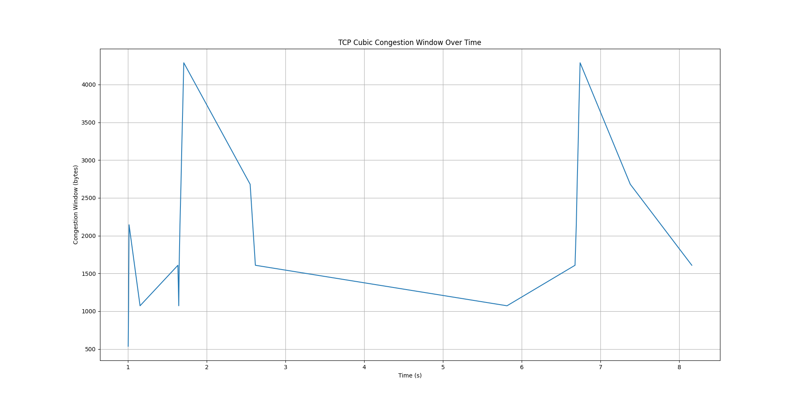

# TCP Variants Analysis in ns-3

This repository contains an analysis of different TCP variants using the ns-3 network simulator. The analysis includes congestion window (cwnd) over time diagrams for various TCP versions.

## Table of Contents

- [Introduction](#introduction)
- [TCP Variants](#tcp-variants)
- [Simulation Setup](#simulation-setup)
- [Results](#results)

## Introduction

This project aims to compare the behavior of different TCP variants in ns-3, focusing on their congestion control mechanisms. We simulate multiple TCP variants and analyze their performance by visualizing the congestion window (cwnd) over time.

## TCP Variants

The TCP variants analyzed in this project include:

- TCP NewReno
- TCP Tahoe
- TCP Westwood
- TCP Vegas
- TCP BBR
- ... (add more)

## Simulation Setup

The simulation code is based on the `fifth.cc` example from the `examples/tutorial` directory of ns-3. The code is modified to simulate different TCP variants and collect the cwnd data over time.

## Results

Below are the cwnd over time diagrams for different TCP variants:

### TCP NewReno

### TCP Bic

### TCP Westwood+

### TCP Vegas

### TCP BBR

### TCP Cubic

### TCP High Speed

### TCP Hybola

### TCP Illinois

### TCP Scalable

### TCP Veno

### TCP Yeah

## Getting Started

### Prerequisites

- ns-3 (version X.XX or higher)
- Python (for running the analysis script)

## License

This project is licensed under the GNU General Public License (GPL). The simulation code is based on `examples/tutorial/fifth.cc` from ns-3.

For more details, see the [LICENSE](LICENSE) file.
